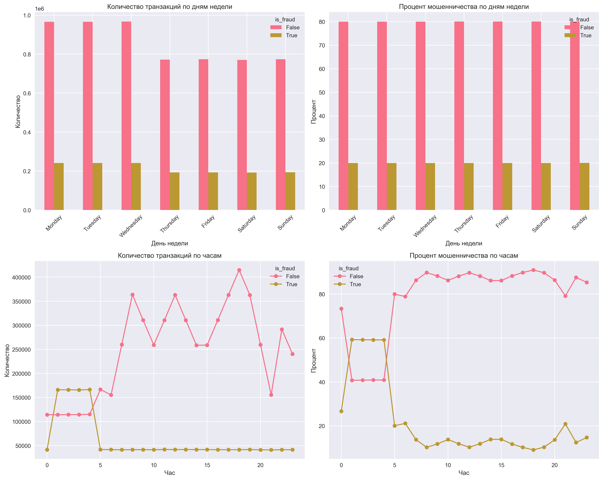
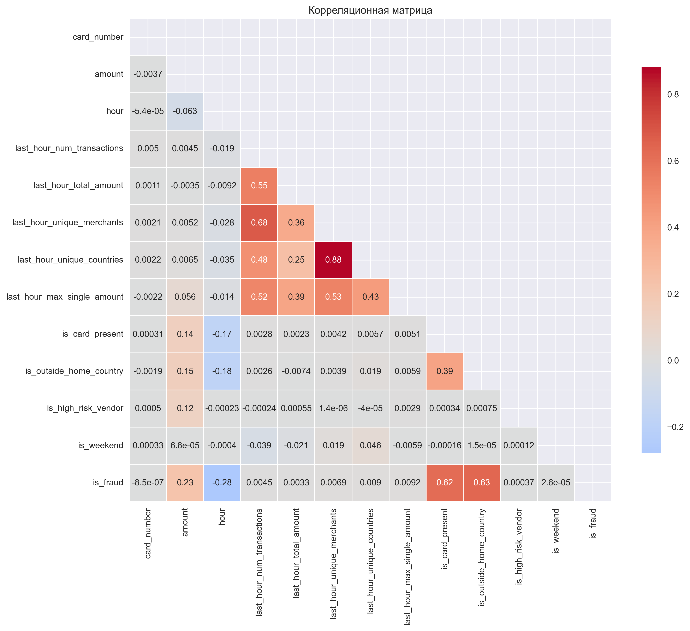

# Анализ данных транзакций для обнаружения мошенничества

## Описание задания

В этом проекте я провел комплексный анализ данных транзакций, чтобы понять, как можно выявлять мошеннические операции. На основе анализа сформулировал продуктовые и технические гипотезы для будущей системы обнаружения мошенничества.

## Как я работал над заданием

### 1. Первичный анализ данных
- Сначала изучил структуру файлов `transaction_fraud_data.parquet` и `historical_currency_exchange.parquet` — посмотрел, какие есть признаки, как устроены данные.
- Написал скрипт EDA (`eda/eda.py`), чтобы быстро получить основные инсайты: сколько транзакций, сколько мошенничества, какие суммы, какие страны и т.д.

### 2. Конвертация валют
- Понял, что суммы в разных валютах сравнивать некорректно, поэтому реализовал функцию `convert_to_usd()`, которая переводит все суммы в доллары США по историческим курсам на дату транзакции.
- После этого пересчитал все основные метрики и графики уже в единой валюте.

### 3. Формирование гипотез
- На основе EDA выделил ключевые паттерны и сформулировал продуктовые гипотезы (что можно улучшить для бизнеса) и технические (как это реализовать на практике).
- Для каждой гипотезы написал, почему она важна и как ее можно проверить.

## Использованные инструменты
- Python 3.x
- Pandas, NumPy — для работы с данными
- Matplotlib, Seaborn — для визуализации
- Cursor — чтобы ускорить написание кода

## Структура проекта
```
AI_ITMO_DATA_ANALYSIS_TASK/
├── data/
│   ├── transaction_fraud_data.parquet    # Основной датасет транзакций
│   ├── historical_currency_exchange.parquet  # Курсы валют для конвертации
│   └── README.md                         # Описание данных
├── eda/
│   ├── eda.py                           # Основной скрипт EDA
│   ├── eda_results.txt                  # Результаты анализа
│   ├── analysis_with_usd_conversion.md  # Анализ с конвертацией в USD
│   └── plots/                           # Графики и визуализации
├── product_hypotheses.md                # Продуктовые гипотезы
├── technical_hypotheses.md              # Технические гипотезы
└── README.md                           # Этот файл
```

## Ключевые результаты анализа

### Конвертация валют
- Все суммы транзакций приведены к долларам США (USD) с учетом исторических курсов на дату операции. Это позволило корректно сравнивать суммы между странами и валютами.

### Основные инсайты
- Мошеннические транзакции в среднем почти в 2 раза крупнее обычных ($874.61 против $459.78).
- Максимальные суммы мошеннических операций в 5 раз выше, чем у легитимных.
- Есть страны и валюты с очень высоким риском (например, MXN, BRL, RUB, NGN — там доля мошенничества доходит до 38%).
- Самые сильные корреляции с мошенничеством: транзакции за пределами страны, отсутствие карты, крупные суммы, ночное время.

### Размер датасета
- Всего транзакций: 7,483,766
- Мошеннических: 1,494,719 (20%)
- Период: 30 дней (сентябрь-октябрь 2024)

---

## Ключевые графики и почему они важны

**1. Распределение мошенничества**


_Этот график показывает, насколько несбалансированы классы._

**2. Временной анализ**


_Здесь видно, в какие дни недели и часы чаще всего происходят мошенничества._

**3. Анализ сумм транзакций**


_Сравнение распределения сумм для обычных и мошеннических транзакций. Видно, что мошенники чаще работают с крупными суммами._

**4. Корреляционная матрица**


_Показывает, какие признаки сильнее всего связаны с мошенничеством._

---

## Продуктовые гипотезы

Я выделил 6 продуктовых гипотез, которые могут реально помочь бизнесу:

- Географический риск (страны с высокой долей мошенничества)
- Карточный риск (транзакции без карты)
- Валютный риск (некоторые валюты — до 38% мошенничества)
- Суммовой риск (крупные суммы — чаще мошенничество)
- Канальный риск (например, POS — 100% мошенничество)
- Ночное мошенничество (ночью риск ниже, но есть всплески)

Подробнее — в файле `product_hypotheses.md`.

---

## Технические гипотезы

Для реализации системы я предложил 6 технических гипотез:

- Машинное обучение (основа системы)
- Feature Engineering (создание новых признаков)
- Real-time Detection (обнаружение в реальном времени)
- Ensemble Methods (ансамбли моделей для устойчивости)
- Anomaly Detection (поиск новых схем мошенничества)

В файле `technical_hypotheses.md` я подробно расписал каждую гипотезу и объяснил, зачем она нужна.

---

## Как запустить анализ

1. Установить зависимости:
```bash
pip install pandas numpy matplotlib seaborn
```
2. Перейти в папку eda и запустить анализ:
```bash
cd eda
python eda.py
```

Результаты появятся в файле `eda_results.txt` и в папке `plots`.

---

## Файлы проекта

- `eda/eda_results.txt` — полный текстовый отчет по анализу
- `eda/analysis_with_usd_conversion.md` — анализ после конвертации в USD
- `product_hypotheses.md` — продуктовые гипотезы
- `technical_hypotheses.md` — технические гипотезы
- `eda/plots/` — все графики

---

## Заключение

В этом проекте я разобрался с большими транзакционными данными, научился конвертировать суммы в единую валюту, нашел ключевые паттерны мошенничества и предложил реальные гипотезы для бизнеса и технической реализации. Если бы я делал следующий шаг — начал бы строить и обучать модели, используя найденные инсайты.