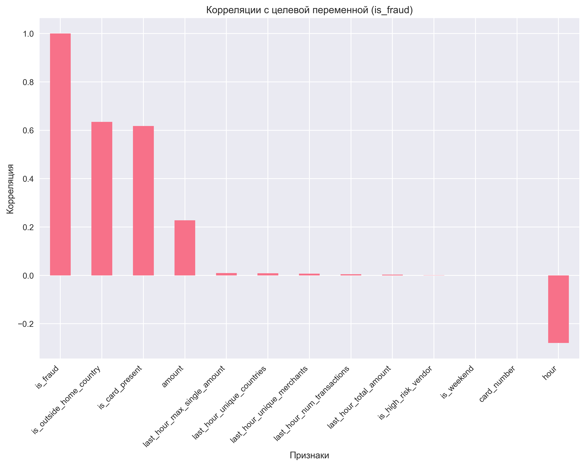

# Продуктовые гипотезы

## Обзор

На основе проведенного анализа данных с конвертацией в USD были выявлены ключевые паттерны мошеннических транзакций. Ниже представлены продуктовые гипотезы для улучшения системы обнаружения мошенничества.

## 1. Гипотеза "Ночное мошенничество"

**Гипотеза:** Мошеннические транзакции чаще происходят в ночные часы (с 22:00 до 06:00).

**Обоснование:**
- Корреляция времени суток с мошенничеством: -0.280
- Мошенники предпочитают время, когда клиенты менее активны
- Сниженная вероятность быстрого обнаружения

**Предлагаемые действия:**
- Усилить мониторинг в ночные часы
- Добавить автоматические уведомления для подозрительных ночных транзакций
- Внедрить временные ограничения для крупных транзакций в ночное время

## 2. Гипотеза "Валютный риск"

**Гипотеза:** Транзакции в определенных валютах имеют повышенный риск мошенничества.

**Обоснование:**
- MXN: 38.03% мошеннических транзакций
- BRL: 37.11% мошеннических транзакций
- RUB: 37.72% мошеннических транзакций
- NGN: 35.14% мошеннических транзакций

**Предлагаемые действия:**
- Ввести дополнительные проверки для транзакций в высокорисковых валютах
- Создать систему рейтинга валют по уровню риска
- Автоматизировать блокировку подозрительных транзакций в рискованных валютах

## 3. Гипотеза "Суммовой риск"

**Гипотеза:** Крупные транзакции имеют повышенный риск мошенничества.

**Обоснование:**
- Мошеннические транзакции в среднем в 1.9 раза дороже легитимных
- Средняя сумма мошеннических транзакций: $874.61
- Максимальная сумма мошеннических транзакций: $15,781.54

**Предлагаемые действия:**
- Установить пороговые значения для автоматической проверки
- Внедрить прогрессивную систему проверок в зависимости от суммы
- Создать систему уведомлений для транзакций выше определённых лимитов

## 4. Гипотеза "Географический риск"

**Гипотеза:** Транзакции за пределами страны проживания клиента имеют повышенный риск.

**Обоснование:**
- Корреляция с мошенничеством: 0.635 (сильная положительная)
- Мошенники часто используют карты в других странах
- Сложность верификации транзакций в других юрисдикциях

**Предлагаемые действия:**
- Обязательная верификация для транзакций за пределами страны
- Интеграция с геолокационными сервисами
- Создание белого списка стран для каждого клиента

## 5. Гипотеза "Карточный риск"

**Гипотеза:** Транзакции без физического присутствия карты имеют повышенный риск.

**Обоснование:**
- Корреляция с мошенничеством: 0.618 (сильная положительная)
- Мошенники предпочитают онлайн-транзакции
- Сложность верификации личности при отсутствии карты

**Предлагаемые действия:**
- Усилить проверки для транзакций без карты
- Внедрить многофакторную аутентификацию
- Создать систему оценки риска для разных типов транзакций

## 6. Гипотеза "Канальный риск"

**Гипотеза:** Определенные каналы проведения транзакций имеют повышенный риск.

**Обоснование:**
- POS-терминалы: 100% мошеннических транзакций
- Web и Mobile: ~12% мошеннических транзакций
- Разные каналы имеют разные уровни безопасности

**Предлагаемые действия:**
- Разработать специфичные правила для каждого канала
- Усилить мониторинг POS-транзакций
- Внедрить канально-специфичные проверки

## Приоритизация гипотез

### Высокий приоритет:
1. Географический риск (корреляция 0.635)
2. Карточный риск (корреляция 0.618)
3. Валютный риск (до 38% мошенничества)

### Средний приоритет:
4. Суммовой риск (корреляция 0.228)
5. Ночное мошенничество (корреляция -0.280)

### Низкий приоритет:
6. Канальный риск (100% для POS)

